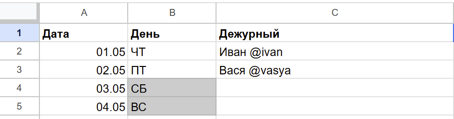

## Duty telegram sender

Скрипт, который в заданное время присылает дежурного в выбранный чат. График дежурств составляется в Google Sheet:



где колонка:
- __A__ - Дата в формате DD.MM
- __B__ - День недели, для удобства, не используется
- __С__ - Имя и ник в телеграме (чтобы ему пришло уведомление), можно без ника или любой другой текст. Если поле пустое - ничего не отправляется. 

Далее нужно сделать таблицу видимой, чтобы получилась ссылка вида

```
https://docs.google.com/spreadsheets/d/{SHEET_ID}/edit?usp=sharing
```
{SHEET_ID} - понадобится для настройки

Зарегистрировать телеграм бота и добавить его в группу. Получить CHAT_ID чата и THREAD_ID (при необходимости)

# Сборка
```
docker build .  -t duty-bot
```

# Запуск 
```
docker run -d --name duty-bot \
  -e TELEGRAM_TOKEN="12345678:AABBCCDDEEFF12345678" \
  -e CHAT_ID="-100000000" \
  -e THREAD_ID="666" \
  -e SHEET_ID="13NCJCU786hs8D9D42LJ4r4р" \
  -e DAILY_JOB_HOUR="9" \
  -e DAILY_JOB_MINUTE="0" \
  duty-bot
```


